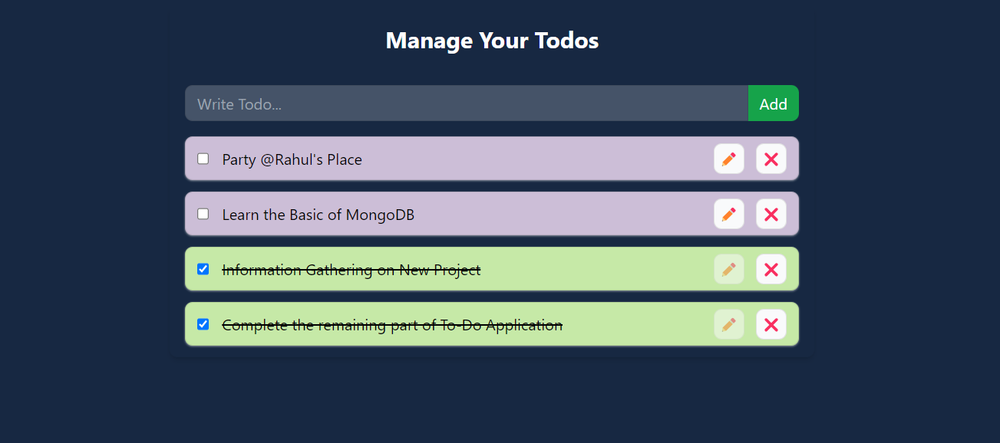

# TO-DO Application

Introducing our innovative TO-DO application tailored for students and working professionals, meticulously designed to streamline task management effortlessly. Our product serves as a comprehensive solution, alleviating the burden of remembering day-to-day responsibilities, ensuring individuals can focus on their priorities without the hassle of constantly keeping track.

The core objective behind the development of this application is to provide users with a seamless and intuitive interface that simplifies task organization and prioritization. We recognize the diverse needs of our users, spanning from students with academic commitments to busy professionals managing workloads, and have crafted a solution that caters to all demographics.

We incorporated the bellow features into our TO-DO application, we aim to provide users with a seamless and efficient task management experience, empowering them to stay organized and productive in their daily endeavors.

## Features

- Enhancing user experience through a user-friendly interface, ensuring effortless navigation and interaction for seamless task management.
- Utilizing local storage to maintain task lists, providing users with the convenience of accessing their tasks across sessions without the need for internet connectivity.
- Leveraging API context to enable dynamic task management functionalities such as adding and deleting items from the list. This ensures real-time updates and synchronization with the server, enhancing efficiency and accuracy.
- Empowering users to modify task entries even after they have been added to the list. This flexibility allows for adjustments and updates to be made to tasks as needed, ensuring accuracy and relevance.
- Implementing a visual cue system to highlight completed tasks, enhancing user engagement and providing a sense of accomplishment. Completed tasks are visually differentiated using distinct CSS styles, offering clear feedback on progress and status.

## Technologies / Tools used for building this app includes

# Demo :movie_camera:

 View live preview [here](https://to-do-fawn-xi.vercel.app/).

## Contact
If you have any suggestions on what to improve in <em>To-Do Application </em> and would like to share them, feel free to drop mail to implement your own ideas 

Chintan Marvaniya - chintanmarvaniya985@example.com

Project Link: [https://github.com/chintanmarvaniya1/to-do](https://github.com/chintanmarvaniya1/to-do)
